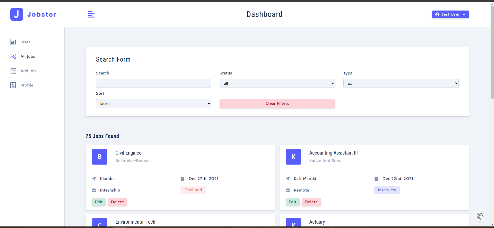

# Project

Jobster is an app to track job application process in ReactJS. The app is a part of [React tutorial and projects course](https://www.udemy.com/course/react-tutorial-and-projects-course/) by John Smilga.

## Live demo

Link :

## Techologies

- React Routing
- React Redux
- React Icons
- React Toastify
- Axios
- Moment
- Styled components
- Recharts

## Features

- Login, register or login as demo user
- Profile info and update profile info
- Create a new job
- See all jobs, filter, update and delete them
- Se stats about jobs

## Run The App Locally

```sh
npm run install && npm start
```

## API Documentation

This section provides information about the API endpoints available in the project.

### Base URL

The base URL for all API endpoints is: `https://jobify-prod.herokuapp.com/api/v1/toolkit`

### Endpoints

#### Register user

- POST /auth/register
- body = {name:'john',email:'john@gmail.com',password:'secret'}
- sends back the user object with token

#### Login user

- POST /auth/login
- body = {email:'john@gmail.com',password:'secret'}
- sends back the user object with token

#### Update user

- PATCH /auth/updateUser
- body = { email:'john@gmail.com', name:'john', lastName:'smith', location:'my location' }
- authorization header : 'Bearer token'
- sends back the user object with token

#### Create job

- POST /jobs
- body = { position:'position', company:'company', jobLocation:'location', jobType:'full-time', status:'pending' }
- authorization header : 'Bearer token'
- sends back the job object

#### Get all jobs

- GET /jobs
- authorization header : 'Bearer token'
- returns {jobs:[],totalJobs:number, numOfPages:number }

#### Delete job

- DELETE /jobs/jobId
- authorization header : 'Bearer token'

#### Edit Job

- PATCH /jobs/jobId
- body = { position:'position', company:'company', jobLocation:'location', jobType:'full-time', status:'pending' }
- authorization header : 'Bearer token'
- sends back the updated job object

### Get Stats

- GET /jobs/stats
- authorization header : 'Bearer token'
- returns { defaultStats:{pending:24,interview:27,declined:24}, monthlyApplications:[{date:"Nov 2021",count:5},{date:"Dec 2021",count:4} ] }
- last six months

##Screenshots

## 

## 
